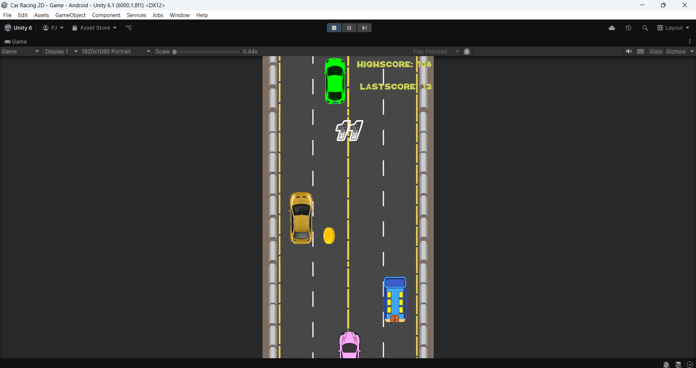

# 🚗 Car Racing 2D Game

Welcome to **Car Racing 2D**, a simple yet addictive 2D racing game developed using Unity Engine.  
Drive your car, avoid obstacles, and challenge yourself to survive longer — now available for **PC and Android**!

---

## 🎮 Gameplay Preview

### 🏁 Start Screen  


### 🕹️ In-Game Racing  


### 💥 Collision or Game Over  


---

## ✨ Features

- 🏎️ Smooth 2D car movement  
- 🎮 Dual Platform Support:  
  • Keyboard controls on PC/laptop  
  • Touch controls on Android devices  
- ⛔ Obstacle collision detection  
- 🌀 Endless gameplay loop  
- 🔊 Game over and restart logic  
- 📱 Optimized for mobile screen sizes  
- 💡 Beginner-friendly Unity project

---

## 🛠️ Tech Stack

| Tool          | Purpose                 |
|---------------|--------------------------|
| Unity 2D      | Game development engine |
| C#            | Scripting and logic     |
| Visual Studio | Code editing            |
| Git & GitHub  | Version control         |

---

## 🚀 How to Run the Game

### 💻 On PC/Laptop

1. Clone the repository:

    ```bash
    git clone https://github.com/parijin0/Car-Racing-2D.git
    ```

2. Open the project in **Unity Hub**

3. Load the main scene from `Assets/Scenes/`

4. Click ▶️ **Play** to start the game

➡️ Use **Left** and **Right Arrow Keys** to move the car

---

### 📱 On Android

1. Build the game for Android using **Unity's Build Settings**

2. Transfer the `.apk` file to your Android device

3. Install and open it

👉 Use **touch gestures** on the left/right sides of the screen to control the car

---

## 🎮 Gameplay Controls

| Platform | Control Type | Action              |
|----------|---------------|---------------------|
| PC       | Arrow Keys    | Move car left/right |
| Android  | Touch         | Tap left/right side |

---
### 📁 Folder Structure

```plaintext
CAR RACING 2D/
├── .vscode/
│   ├── launch.json
│   └── settings.json
├── Assets/
│   ├── Animations/
│   ├── fonts/
│   ├── Materials/
│   └── Media/
│       ├── Screenshot1.png
│       ├── Screenshot2.png
│       └── Screenshot3.png
├── Resources/
├── scripts/
│   ├── Car_Movement.cs
│   ├── Car_Spawner.cs
│   ├── Coin_Manager.cs
│   ├── Game_Controller.cs
│   └── MainMenu_Controller.cs
└── README.md

```

### 📚 Learnings & Scope

Through this project, I explored:

- 🔄 Unity physics & Rigidbody behavior  
- 💥 Collision detection and game state management  
- 🎮 Multi-platform input handling (PC keyboard + Android touch)  
- 🎨 UI elements with canvas and responsive layout  
- 📱 Android build and APK export  

---

### 👩‍💻 Author

Made with ❤️ by **Pari Jindal**  
🎓 *B.Tech CSE Student | Passionate about Software Development & Problem Solving*  
🔗 [GitHub: parijin0](https://github.com/parijin0)
